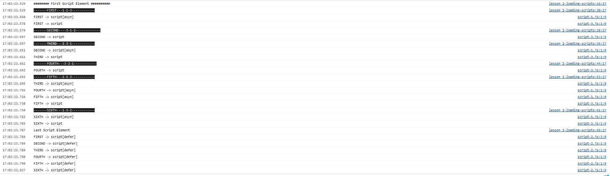
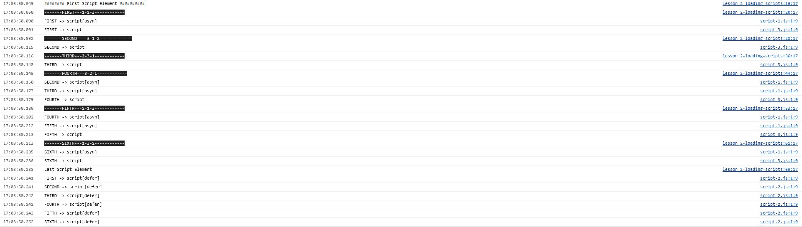
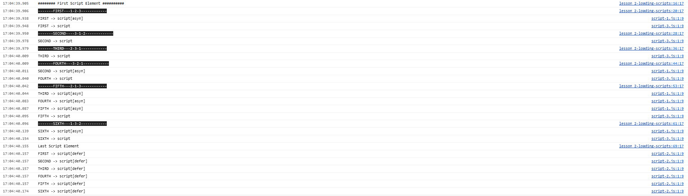

# Explaination

### Finding 
- Adding "defer" to a script tag ensures it loads after all other content.
- Async on that other hand, using "async" allows scripts to load asynchronously without blocking subsequent script execution. 
- Scripts load immediately and where they are requested when neither "defer" nor "async" attributes are used.

### Test output 

