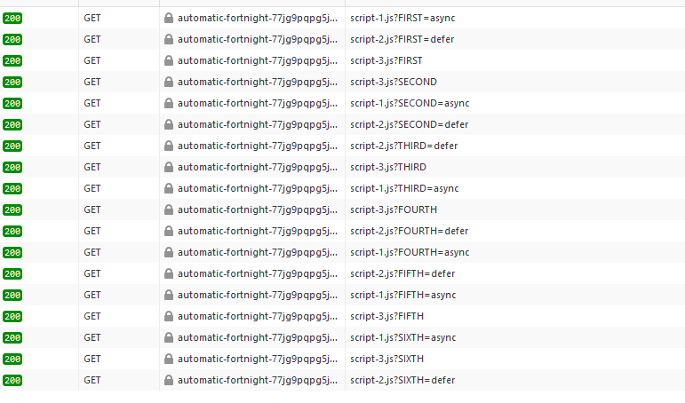

# Explaination

### Finding 
- Adding `defer` to a script tag ensures it execute after everything has finished loading. 
    - Note: 
        - `defer` maintains the order of execution
- Async on that other hand, using `async` allows scripts to download on separate thread and execute once it is downloaded 
    - Note:
        - `async` is random which you can also see in test output added below. 
- Scripts download and executed, when neither `defer` nor `async` attributes are used 
    - Note:
        - This block the executing until the script is downloaded and executed.
        - This also maintains the order but at the cost of time to download the resource.
- Both `defer` and `async` attribute on script tag tell browser to download script on different thread so further execution of html document is not block
- Best is to use `defer` for better performance and to have a excepted behavior

### NOTE -  Scripts are always initiated to download in the order they are placed in the HTML document.

### Test output 

